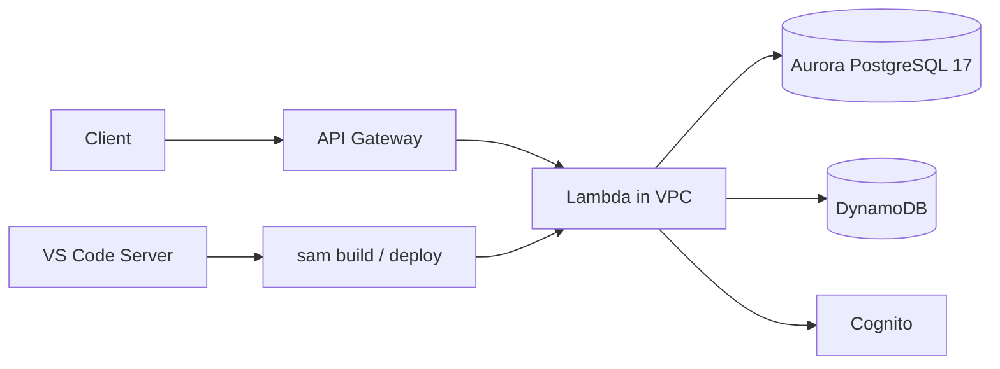

# Secure Serverless (Python)

Python port of the [AWS Serverless Security Workshop](https://github.com/aws-samples/aws-serverless-security-workshop)
Wild Rydes API. Lambdas run **Python 3.9** and connect to **Aurora PostgreSQL 17** using **IAM database authentication
** (`sslmode=require`).

**New to AWS Serverless?**

- [docs/WORKSHOP_GUIDE.md](docs/WORKSHOP_GUIDE.md) — step-by-step introduction
- [docs/AWS_SERVICES_TECHNICAL_GUIDE.md](docs/AWS_SERVICES_TECHNICAL_GUIDE.md) — detailed service-by-service reference (
  Lambda, API Gateway, VPC, Aurora, IAM, etc.)

## Project layout

```
secure-serverless/
├── apiclient/                    Static API test UI (Live Preview on index.html)
├── bootstrap.sh                  Optional VS Code Server bootstrap hook
├── docs/
│   ├── WORKSHOP_GUIDE.md         Beginner's guide — start here if you're new
│   └── AWS_SERVICES_TECHNICAL_GUIDE.md  Deep dive: every AWS service explained
├── secure-serverless-template.yaml   VPC, security groups, workshop IAM modules
├── vscode-server-template.yaml   Browser-based VS Code (code-server + CloudFront)
└── src/
    ├── app/                      Lambda handlers (Python)
    ├── authorizer/               Cognito JWT custom authorizer
    ├── init/
    │   ├── init-template.yml     VPC + Aurora PostgreSQL 17 (standalone bootstrap)
    │   └── db/queries.sql        PostgreSQL schema and seed data
    └── template.yaml             SAM application template
```

## Architecture



| Component | Details                                                                         |
|-----------|---------------------------------------------------------------------------------|
| Runtime   | Python 3.9 (SAM builds via Docker — host Python version does not need to match) |
| Database  | Aurora PostgreSQL 17, port **5432** (not MySQL 3306)                            |
| Auth      | IAM token via `rds:GenerateDBAuthToken`, user `postgres`                        |
| Network   | Lambda in private subnets; needs SG rules to reach Aurora                       |
| Secrets   | No passwords or endpoints in source code — supplied at deploy time              |

## Security

This project does **not** embed database passwords, cluster endpoints, or demo user credentials in source code.

| Setting                     | How it is provided                                             |
|-----------------------------|----------------------------------------------------------------|
| Aurora endpoint (`DB_HOST`) | Required SAM parameter `DbHost` at deploy                      |
| Database auth               | IAM tokens (`DB_USE_IAM_AUTH=true`) or `DB_PASSWORD` env var   |
| Aurora master password      | CloudFormation parameter `DbPassword` (`NoEcho`)               |
| ABAC demo user password     | CloudFormation parameter `WorkshopDemoUserPassword` (`NoEcho`) |
| VS Code Server password     | Generated at deploy time (stack output)                        |

Never commit real passwords or production endpoints. Use environment variables, CloudFormation parameters, or IAM auth.

## Deployment options

### Option A — Workshop Studio (recommended)

Deploy infrastructure, then the VS Code environment, then the SAM app.

**1. Deploy VPC and workshop resources**

```bash
aws cloudformation deploy \
  --template-file secure-serverless-template.yaml \
  --stack-name Secure-Serverless \
  --capabilities CAPABILITY_NAMED_IAM \
  --parameter-overrides \
    DbPassword='YOUR-STRONG-PASSWORD' \
    WorkshopDemoUserPassword='YOUR-DEMO-USER-PASSWORD'
```

This creates the VPC, subnets, NAT gateway, Lambda security group, deployment S3 bucket, and workshop IAM/GuardDuty
modules. It does **not** create an Aurora cluster — use your own RDS cluster or deploy `src/init/init-template.yml`
separately.

**2. Package and upload workshop assets (optional)**

```bash
zip -r workshop.zip . -x '.git/*' '.venv/*'
aws s3 cp workshop.zip s3://YOUR-BUCKET/workshop.zip
```

**3. Deploy VS Code Server**

```bash
aws cloudformation deploy \
  --template-file vscode-server-template.yaml \
  --stack-name VSCodeServer \
  --capabilities CAPABILITY_NAMED_IAM \
  --parameter-overrides AssetZipS3Path='YOUR-BUCKET/workshop.zip'
```

Stack outputs include the **CloudFront URL** and **password**. Open the URL to get a browser IDE in `/Workshop`.

**4. Deploy the SAM application**

From the VS Code terminal (or any Cloud9/EC2 instance with SAM and Docker):

```bash
cd /Workshop/src

DEPLOY_BUCKET=$(aws cloudformation describe-stacks \
  --stack-name Secure-Serverless \
  --query "Stacks[0].Outputs[?OutputKey=='DeploymentS3Bucket'].OutputValue" \
  --output text)

sam build
sam deploy \
  --stack-name CustomizeUnicorns \
  --s3-bucket "$DEPLOY_BUCKET" \
  --capabilities CAPABILITY_IAM \
  --parameter-overrides \
    DbHost='YOUR-AURORA-CLUSTER-ENDPOINT' \
    DbUser='postgres' \
    DbName='unicorn_customization'
```

`DbHost` is **required** — there is no default in `template.yaml`.

### Option B — Init stack with Aurora

Use `src/init/init-template.yml` when you want CloudFormation to create Aurora PostgreSQL 17 inside the workshop VPC (
includes Cloud9):

```bash
cd src/init
aws cloudformation deploy \
  --template-file init-template.yml \
  --stack-name Secure-Serverless \
  --capabilities CAPABILITY_IAM \
  --parameter-overrides DbPassword='YOUR-STRONG-PASSWORD'
```

Then deploy the SAM app as in step 4 above, using the `AuroraEndpoint` stack output for `DbHost`.

## Database setup

Connect with IAM auth (password is a generated token, not a static secret):

```bash
export RDSHOST="your-cluster.cluster-xxxx.us-east-1.rds.amazonaws.com"
export PGPASSWORD="$(aws rds generate-db-auth-token \
  --hostname "$RDSHOST" --port 5432 --region us-east-1 --username postgres)"

# One-time: grant IAM auth to postgres user
psql "host=$RDSHOST port=5432 dbname=postgres user=postgres sslmode=require password=$PGPASSWORD" \
  -c 'GRANT rds_iam TO postgres;'

# Create application database if it does not exist
psql "host=$RDSHOST port=5432 dbname=postgres user=postgres sslmode=require password=$PGPASSWORD" \
  -c 'CREATE DATABASE unicorn_customization;'

# Apply schema and seed data
psql "host=$RDSHOST port=5432 dbname=unicorn_customization user=postgres sslmode=require password=$PGPASSWORD" \
  -f src/init/db/queries.sql
```

Verify:

```bash
psql "host=$RDSHOST port=5432 dbname=unicorn_customization user=postgres sslmode=require password=$PGPASSWORD" \
  -c 'SELECT count(*) FROM "Socks";'
```

## Test the API

After deploy, get the API URL from CloudFormation outputs or API Gateway:

```bash
curl -s "https://YOUR-API-ID.execute-api.us-east-1.amazonaws.com/dev/socks" | jq .
```

Or open `apiclient/index.html` in your editor's **Live Preview**, enter the API base URL, and use **Module 0** to test
`GET /socks` without auth.

## SQL injection demo (workshop)

`POST /customizations` intentionally builds SQL with string interpolation.

**Use only in your own workshop environment.**

### Prerequisites

1. A partner OAuth token with `WildRydes/CustomizeUnicorn` scope (from `POST /partners`).
2. `POST https://YOUR-API-ID.execute-api.us-east-1.amazonaws.com/dev/customizations`
3. Header: `Authorization: Bearer <partner-access-token>`
4. Header: `Content-Type: application/json`

**Request body:**

```json
{
  "name": "Orange-themed unicorn",
  "imageUrl": "https://en.wikipedia.org/wiki/Orange_(fruit)",
  "sock": "1",
  "horn": "2",
  "glasses": "3",
  "cape": "2) RETURNING \"ID\"; INSERT INTO \"Socks\" (\"NAME\", \"PRICE\") VALUES ('Bad color', 100.0) RETURNING \"ID\"; --"
}
```

**SQL produced (simplified):**

```sql
INSERT INTO "Custom_Unicorns" (...)
VALUES ('Orange-themed unicorn', 34, '...', 1, 2, 3, 2) RETURNING "ID";

INSERT INTO "Socks" ("NAME", "PRICE") VALUES ('Bad color', 100.0) RETURNING "ID";

-- ) RETURNING "ID"
```

## Configuration reference

Environment variables (set in `src/template.yaml` Globals):

| Variable          | Required                  | Default                 | Purpose                                            |
|-------------------|---------------------------|-------------------------|----------------------------------------------------|
| `DB_HOST`         | Yes                       | —                       | Aurora cluster endpoint (SAM parameter `DbHost`)   |
| `DB_USER`         | No                        | `postgres`              | IAM-enabled database user                          |
| `DB_NAME`         | No                        | `unicorn_customization` | Application database                               |
| `DB_USE_IAM_AUTH` | No                        | `true`                  | Use `generate_db_auth_token()` instead of password |
| `DB_PASSWORD`     | Only if IAM auth disabled | —                       | Static password fallback (not recommended)         |

Lambda functions also need the `rds-db:connect` IAM policy (already in `template.yaml` per function).

## Troubleshooting

Issues encountered during the Node.js → Python migration and how they were resolved:

| Symptom                                    | Cause                                | Fix                                                         |
|--------------------------------------------|--------------------------------------|-------------------------------------------------------------|
| `sam build` fails — Python 3.12 not found  | Cloud9/AL2 only had Python 3.9       | Runtime set to `python3.9`; SAM builds in Docker            |
| `Policies` under `Globals.Function`        | SAM does not support this            | Policies defined on each function resource                  |
| `name 'DB_USER' is not defined`            | Partial edit of `db_utils.py`        | Config read at runtime via `_get_user()` helpers            |
| Connection timeout on port 5432            | Lambda SG could not reach Aurora SG  | Allow Lambda egress **and** DB ingress on 5432 (see below)  |
| `Internal server error` (no details)       | Same SG issue or wrong port          | Use CloudWatch logs; confirm port 5432 not 3306             |
| Auth failures                              | Using static password instead of IAM | Set `DB_USE_IAM_AUTH=true`, run `GRANT rds_iam TO postgres` |
| `DB_HOST environment variable is required` | `DbHost` not passed at deploy        | Redeploy with `--parameter-overrides DbHost='...'`          |

### Security group fix (Lambda ↔ Aurora)

Lambda runs in private subnets. Both sides must allow PostgreSQL traffic:

```bash
LAMBDA_SG=$(aws cloudformation list-exports \
  --query "Exports[?Name=='Secure-Serverless-LambdaSecurityGroup'].Value" --output text)

DB_SG=$(aws rds describe-db-clusters --db-cluster-identifier YOUR-CLUSTER \
  --query 'DBClusters[0].VpcSecurityGroups[0].VpcSecurityGroupId' --output text)

# Lambda → database
aws ec2 authorize-security-group-egress \
  --group-id "$LAMBDA_SG" \
  --ip-permissions IpProtocol=tcp,FromPort=5432,ToPort=5432,UserIdGroupPairs="[{GroupId=$DB_SG}]"

# Database ← Lambda
aws ec2 authorize-security-group-ingress \
  --group-id "$DB_SG" \
  --ip-permissions IpProtocol=tcp,FromPort=5432,ToPort=5432,UserIdGroupPairs="[{GroupId=$LAMBDA_SG}]"
```

If Aurora is **publicly accessible**, Lambda traffic exits via the NAT gateway — also allow the NAT gateway public IP on
the database security group, or disable public access and use the private endpoint in the same VPC.

The templates (`secure-serverless-template.yaml`, `src/init/init-template.yml`) now include VPC CIDR egress on port 5432
for Lambda. Existing stacks must be updated or rules added manually.

## Template verification notes

### `secure-serverless-template.yaml`

- PostgreSQL port **5432** on Aurora security group (not MySQL 3306)
- Lambda SG egress to VPC CIDR and internet (for NAT/public RDS scenarios)
- Exports `Secure-Serverless-VPC-ID`, subnets, and `LambdaSecurityGroup` for the VS Code stack
- Does not create Aurora — use external RDS or `src/init/init-template.yml`
- Includes workshop modules: CloudTrail, ABAC demo, GuardDuty (Workshop Studio mode)
- Requires `DbPassword` and `WorkshopDemoUserPassword` parameters at deploy (no defaults)

### `vscode-server-template.yaml`

- Bootstraps AL2023 with SAM CLI, Docker, Node.js 22, **PostgreSQL client (`psql`)**, and **jq**
- Imports VPC/subnet from `Secure-Serverless` stack exports
- Unzips workshop assets to `/Workshop` (expects `src/` inside)
- Runs `/Workshop/bootstrap.sh` if present
- Serves code-server via CloudFront (password in stack output)

## Local development

```bash
python3 -m venv .venv && source .venv/bin/activate
pip install -r src/app/requirements.txt
```

SAM local invoke requires Docker and VPC configuration matching your Aurora setup.

## Credits

Based
on [aws-samples/aws-serverless-security-workshop](https://github.com/aws-samples/aws-serverless-security-workshop),
converted from Node.js to Python with Aurora PostgreSQL 17 and IAM authentication.
